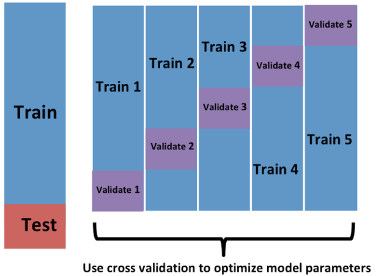
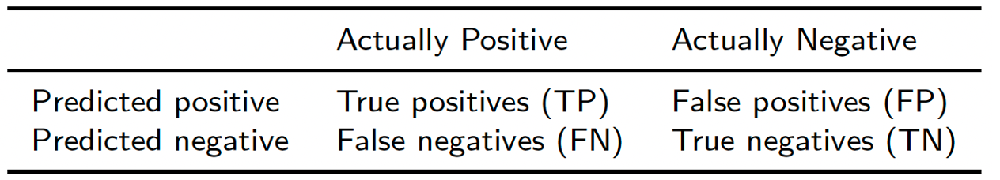
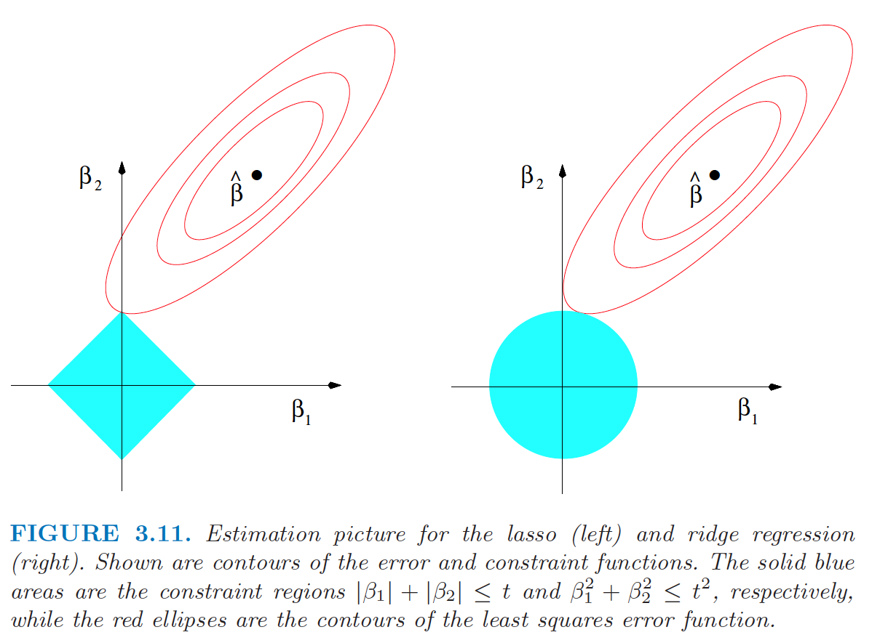
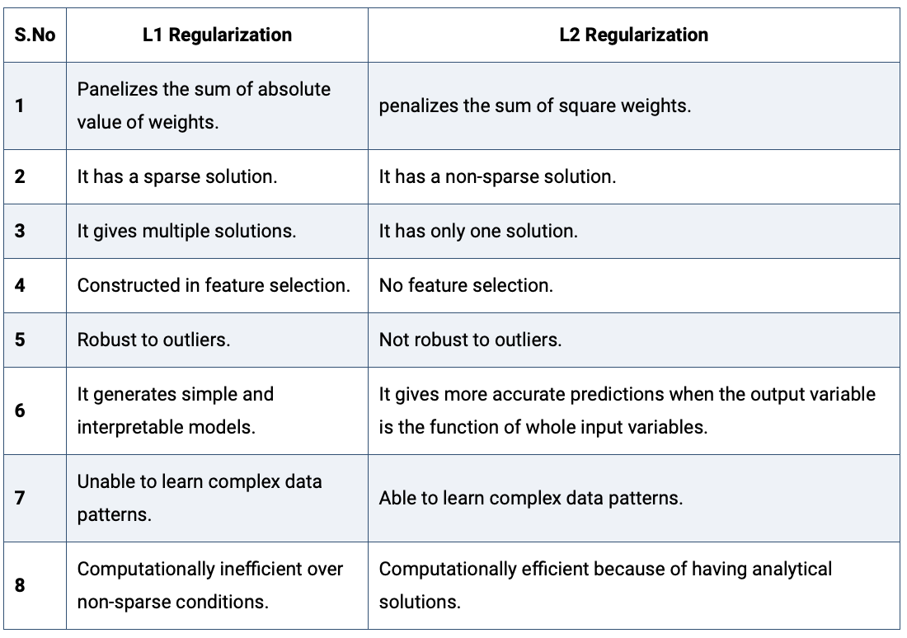

## GitHub Page
\Large
Here is a link to the GitHub Repository for this tutorial: 

\normalsize
https://github.com/wevanjohnson/2024_05_RRDS_ML_Workshop/

\Large
Please download, clone, or fork this directory to get the materials! 

## Tools to install
Here is the list of R packages to install for this tutorial: 

* Data management and visualization: 
`tidyverse`, `DT`, `gridExtra`, and `dslabs` (Rafa Irizarry’s datasets for his Data Science book!). 
```{r, eval=F}
install.packages(c(tidyverse, DT, gridExtra, dslabs))
```

* Machine learning: `caret`, `e1071`, `rpart`, `neuralnet`
```{r, eval=F}
install.packages(c(caret, e1071, rpart, neuralnet))
```

And download (using R) this dataset (from the Elements of Statistical Learning book) and put it in your working directory: 
```{r, eval=F}
download.file("http://www-stat.stanford.edu/
              ~tibs/ElemStatLearn/datasets/ESL.mixture.rda", 
              destfile='ESL.mixture.rda')
```

## Agenda
\Large
* Introduction to Machine Learning Terminology
* Definition of features, labels, data preparation, input, output, etc.
* Overview of Machine Learning Methods
  + Data preparation
  + Supervised and unsupervised learning
  + Model training and testing
  + Model evaluation / performance metrics
* Kernel-based Methods
  + Conceptual understanding
* Decision Trees
* Neural Networks
* Code + case studies are integrated throughout

## Formal definitions
\Large
**Machine learning** is a computer’s way of learning from examples, and it is one of the most useful tools we have for the construction of _artificially intelligent_ systems

**Artificial intelligence** is a term used when machines (or computers) can mimic functions that humans can do.

  - Example: Learning and problem solving

## Formal definitions
\Large
An **Algorithm** is a sequence of actions that are “self-contained”

* Effective method for calculation
  + Finite steps/instructions
  + When applied, it produces a correct answer
  + The instructions need to be followed
  + In principle, it can be done by a “human”

## Formal definitions
\Large
A **Computer Algorithm** is a sequence of actions that are “self-contained”

* Effective method for calculation
  + Finite steps/instructions
  + When applied, it produces a correct answer
  + The instructions need to be followed
  + In principle, it can be done by a “computer”

## Formal definitions
\Large
* Computer Code:
  + Human readable text
  + Fully executable description of a software system

* What’s in the data?
  + Datum: “(thing) given”
  + Data is useful only when it has been analyzed

## Supervised vs unsupervised learning
\Large
Machine learning algorithms are generally classified into two categories:

1. **Supervised:** Outcomes used to create the predictor, e.g., classification.
2. **Unsupervised:** Don't know outcomes, rather interestedin discovering groups, e.g., clustering.

## Formal definitions
\Large
**Training and Test sets:** We usually split our dataset into two parts, one for model creation (train) and one for validation (test)

**Cross-validation:** Iterative retraining of the predictor on multiple partitions of training set
\center
{height=40%}

## Formal definitions
\Large
**Confusion matrix:** tabulates each combination of predicted and actual values:


**Overfitting:** Dangerously over-optimistic assessments---this is a _big problem_ in machine learning

## The caret package in R
\Large
The `caret` package in R has several useful functions for building and assessing machine learning methods.

- _Examples:_

## Regularization in Machine Learning
In regression analysis, the features are estimated using coefficients while modeling. In small sample sizes or noisy data coefficient estimates could be anecdotally incorrect (e.g., overfitting) or innacurate.  

If the estimates can be restricted, penalized, or shrunk towards zero, then the impact of insignificant features might be reduced and would prevent models from high variance with a stable fit.\footnote{Adapted from: https://www.analyticssteps.com/blogs/l2-and-l1-regularization-machine-learning}

## Regularization in Machine Learning

**Regularization** is the most used technique to penalize complex models in machine learning, it is deployed for reducing overfitting (or, contracting generalization errors) by putting small network weights into the model (adding a small amount of biad). Also, it enhances the performance of models for new inputs.\footnote{Source: https://www.analyticssteps.com/blogs/l2-and-l1-regularization-machine-learning}

Examples of regularization in machine learning, include:

* Regression: Penalizing coefficients to create parsimonious models (variable selection)
* K-means: Restricting the segments for avoiding redundant groups.
* Neural networks: Confining the complexity (weights) of a model.
* Random forests: Reducing the depths of tree and branches (new features)
* Neural networks: Confining the complexity (weights) of a model. 


## Ridge regression
Ridge regression **regularizes** (shrinks) coefficients by imposing a penalty on 
their size. The ridge coefficients minimize a penalized sum of squared error: 
$$\hat\beta^{ridge}=\underset{\beta}\inf\left\{\sum_{i=1}^{N}(y_i-\sum_{j=1}^{p}x_{ij}\beta_j)^2+\lambda\sum_{j=1}^{p}\beta_j^2\right\},$$
where $\lambda\ge 0$ is a parameter that controls the shrinkage. The larger the value of $\lambda$ the more shrinkage  (towards 0). 


## Ridge regression
Or in matrix form, ridge regression minimizes:
$$\hat\beta^{ridge}=\underset{\beta}\inf\left\{({\bf y}-{\bf X}\beta)^T({\bf y}-{\bf X}\beta) + \lambda\beta^T\beta\right\}.$$
With a little work, the ridge regression solution can be shown to be: 
$$\hat\beta^{ridge}=({\bf X}^T{\bf X}+\lambda {\bf I}_N)^{-1}{\bf X}^T{\bf y}$$

## Ridge regression
The regularization for ridge regression, $\lambda\beta^T\beta$, is usually 
denoted as an **L2 regularization** or **L2 penalty**, as it adds a penalty which 
is equal to the square of the magnitude of coefficients. Both Ridge regression and 
Support Vector Machines (SVMs) implement this method.

L2 regularization can deal with multicollinearity problems (independent variables are highly correlated) through constricting the coefficient while keeping all the variables in a model. 

However, L2 regularization is not an effective method for selecting relevant
predictors (or removing redundant parameters). We will later use a **L1 regularization** for this purpose.
 

## Ridge regression: a Bayesian perspective
Ridge regression also has a clear Bayesian interpretation. It can be shown 
that the Ridge penalty can be interpreted as a 'zero' prior (Normal prior with 
zero mean), and the $\lambda$ is related to the variance of the prior.


## Lasso regression
Lasso (Least Absolute Shrinkage and Selection Operator) regression also **regularizes** coefficients by imposing a penalty on 
their size, but it uses an **L1** penalty. The lasso coefficients minimize the following cost function: 
$$\hat\beta^{lasso}=\underset{\beta}\inf\left\{\sum_{i=1}^{N}(y_i-\sum_{j=1}^{p}x_{ij}\beta_j)^2+\alpha\sum_{j=1}^{p}|\beta_j|\right\},$$
where $\alpha\ge 0$ is a parameter that controls the shrinkage. The larger the value of $\alpha$ the more shrinkage  (towards 0). 

## Lasso regression
Notice the similarity to the ridge regression problem: the L2 ridge penalty $\sum_{j=1}^{p}\beta_j^2$ is replaced by the L1 lasso penalty $\sum_{j=1}^{p}|\beta_j|$. 

This latter constraint makes the solutions nonlinear in the $y_i$, and there is no closed form expression for the lasso as was the case in ridge regression. 

Because of the nature of the constraint, making $\alpha$ sufficiently small will cause some of the coefficients to be exactly zero. Thus the lasso does a kind of continuous subset selection, or conducts a **variable selection**.

## Lasso vs Ridge regression
\center
{width=80%}

\scriptsize
([Elements of Statistical Learning](https://hastie.su.domains/Papers/ESLII.pdf), Hastie, Tibshirani, Friedman, by Springer)


## Lasso vs Ridge regression
\center
{width=85%}

\tiny
(https://www.analyticssteps.com/blogs/l2-and-l1-regularization-machine-learning)


## Elastic net regularization
Which should I choose? Ridge or Lasso? Well, why do I have to choose!

Instead use the **Elastic Net** that minimizes: 
$$\hat\beta^{elastic\ net}=\underset{\beta}\inf\left\{\sum_{i=1}^{N}(y_i-\sum_{j=1}^{p}x_{ij}\beta_j)^2+\alpha\sum_{j=1}^{p}|\beta_j|+\lambda\sum_{j=1}^{p}\beta_j^2\right\},$$
for some $\alpha\ge 0$ and $\lambda\ge 0$.

The quadratic penalty term makes the loss function strongly convex, and it therefore has a unique minimum. The elastic net method includes OLS, Lasso, and Ridge regression by setting either $\alpha=0$, $\lambda=0$, or both to 0. 


## Regression Regularization in R: glmnet
We can use the **glmnet** package to apply regularization in R: 

```{r, eval=F}
install.packages("glmnet")
```

The default model used in the package is the “least squares” regression model and glmnet actually optimizes: 
$$\hat\beta^{elastic\ net}=\underset{\beta}\inf\left\{\sum_{i=1}^{N}(y_i-\sum_{j=1}^{p}x_{ij}\beta_j)^2+ \lambda \left( \alpha\sum_{j=1}^{p}|\beta_j|+ (1-\alpha)\sum_{j=1}^{p}\beta_j^2 \right)  \right\},$$ 
with $\alpha=1$ as a default (so Lasso!).

## Kernel-based machine learning
\Large
**Kernel machines** are a class of methods for pattern analysis that use linear classifiers to solve nonlinear problems. 

Kernel methods only require a user-specified kernel, i.e., a similarity function over all pairs of data points computed using inner products.

In contrast, many other algorithms require the explicit transformation of the raw data.

## Kernel based machine learning
\Large
Algorithms that operate with kernels include:

* Kernel perceptron
* Support-vector machines (SVM)
* Gaussian processes
* Principal components analysis (PCA)
* Canonical correlation analysis
* Ridge regression
* Spectral clustering
* Linear adaptive filters


## Session Info
\tiny
```{r session}
sessionInfo()
```
