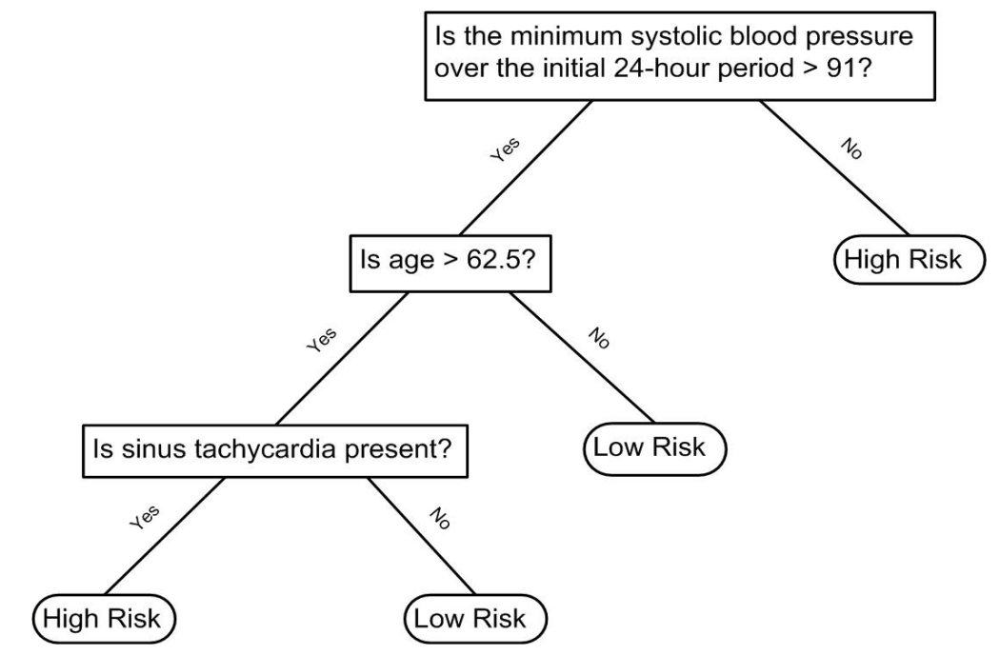

```{r setup, include=FALSE}
knitr::opts_chunk$set(echo = TRUE, fig.align="center")
library(caret)
library(tidyverse)
library(kableExtra)
library(gridExtra)
img_path <- "figs/treeFigs/"
```


## Motivating example: olive oil
To motivate this section, we will use a new dataset that includes the breakdown of the composition of olive oil into 8 fatty acids:
\footnotesize
```{r}
library(tidyverse)
library(dslabs)
data("olive")
olive <- select(olive, -area) #remove the `area` column--don't use it
names(olive) 
```

## Motivating example: olive oil
Here is a quick look at the data:
```{r}
olive %>% head() %>% 
  knitr::kable() %>% kable_styling(font_size =7)
```

## Motivating example: olive oil
We will try to predict the region using the fatty acid composition values as predictors.

```{r}
table(olive$region)
```

## Motivating example: olive oil
Let's very quickly try to predict the region using kNN:
\scriptsize
```{r olive-knn, warning=FALSE, message=FALSE, fig.align='center', fig.height=3,fig.width=4, out.width="50%"}
library(caret)
fit <- train(region ~ .,  method = "knn", data = olive,
             tuneGrid = data.frame(k = seq(1, 15, 2))) 
             
ggplot(fit)
```

\normalsize So using just one neighbor, we can predict relatively well. 

## Motivating example: olive oil
However, a bit of data exploration reveals that we should be able to do even better: note that eicosenoic is only in Southern Italy and linoleic separates Northern Italy from Sardinia.

```{r olive-eda, fig.height=3, fig.width=6, echo=FALSE,out.width="100%"}
olive %>% gather(fatty_acid, percentage, -region) %>%
  ggplot(aes(region, percentage, fill = region)) +
  geom_boxplot() +
  facet_wrap(~fatty_acid, scales = "free", ncol = 4) +
  theme(axis.text.x = element_blank(), legend.position="bottom")
```

## Motivating example: olive oil
This implies that we should be able to build an algorithm that predicts perfectly! Let's try plotting the values for eicosenoic and linoleic.

```{r olive-two-predictors, echo=FALSE,out.width="100%", fig.align='center',fig.height=3,fig.width=6}
olive %>% 
  ggplot(aes(eicosenoic, linoleic, color = region)) + 
  geom_point() +
  geom_vline(xintercept = 0.065, lty = 2) + 
  geom_segment(x = -0.2, y = 10.54, xend = 0.065, yend = 10.54, 
               color = "black", lty = 2)
```

## Motivating example: olive oil
Let's define a **decision rule**: If eicosenoic is larger than 0.065, predict Southern Italy. If not, then if linoleic is larger than $10.535$, predict Sardinia, otherwise predict Northern Italy. We can draw this decision tree:

```{r olive-tree, echo=FALSE, warning=FALSE, message=FALSE, fig.height=3,fig.width=6, out.width="100%"}
library(caret)
library(rpart)
rafalib::mypar()
train_rpart <- train(region ~ ., method = "rpart", data = olive)
plot(train_rpart$finalModel, margin = 0.1)
text(train_rpart$finalModel, cex = 0.75)
```

## Decision Trees
**Decision trees** like this are often used in practice. For example, to evaluate a person's risk of poor outcome after a heart attack, doctors may use:

\center
{width=75%}

\scriptsize
([Source: Walton 2010 Informal Logic, Vol. 30, No. 2, pp. 159-184](https://papers.ssrn.com/sol3/Delivery.cfm/SSRN_ID1759289_code1486039.pdf?abstractid=1759289&mirid=1&type=2).)

## Decision Trees
\Large
A tree is a flow chart of yes or no questions. We define an algorithm that creates trees with predictions at the ends, referred to as __nodes__.

Regression and decision trees, or sometimes called **Classification and Regression Trees (CART)**, predict an outcome $Y$ by partitioning the predictors ${\bf X}$.

## Regression trees

When the outcome is continuous, we call the method a __regression tree__. For example, we use polling data to estimate the conditional expectation $f(x)=\mbox{E}(Y | X = x)$ with $Y$ the poll margin and $x$ the day. 

\small
```{r polls-2008-again, out.width='75%', fig.height=3, fig.width=6, fig.align='center'}
data("polls_2008")
polls_2008 %>% 
  ggplot() + geom_point(aes(day, margin)) 
```

## Regression trees
\Large
The idea is to build a decision tree and, at the end of each __node__, obtain a predictor $\hat{y}$. 

Mathematically, we are partitioning the predictor space into $J$ non-overlapping regions, $R_1, R_2, \ldots, R_J$, and then for any predictor $x$ that falls within region $R_j$, estimate $f(x)$ with the average of the training observations $y_i$ for which the associated predictor $x_i$ is also in $R_j$.

## Regression trees
\Large
Regression trees create partitions recursively. We start the algorithm with one partition, the entire predictor space. In our simple first example, this space is the interval [-155, 1]. 

The first step will partition the space into two partitions. The second step will split one of these partitions into two and we will have three partitions, then four, then five, and so on.

## Regression trees
Let's take a look at what this algorithm does on the 2008 presidential election poll data. We will use the `rpart` function in the __rpart__ package.

```{r}
library(rpart)
fit <- rpart(margin ~ ., data = polls_2008)
```

## Regression trees
We can visually see where the splits were made:

```{r polls-2008-tree, fig.height=5,fig.width=7, out.width="80%", echo=FALSE, fig.align='center'}
rafalib::mypar()
plot(fit, margin = 0.1)
text(fit, cex = 0.75)
```

## Regression trees
The first split is made on day -39.5, then split at day -86.5. The two resulting new partitions are split on days -49.5 and -117.5, respectively, and so on. The final estimate $\hat{f}(x)$ looks like this:

\footnotesize
```{r polls-2008-tree-fit, out.width='75%', fig.height=3, fig.width=6, fig.align='center'}
polls_2008 %>% 
  mutate(y_hat = predict(fit)) %>% ggplot() +
  geom_point(aes(day, margin)) + geom_step(aes(day, y_hat), col="red")
```

## Regression trees
\Large
Note that the algorithm stopped partitioning at 8. Every time we split and define two new partitions, our training set RSS decreases because our model has more flexibility to adapt to the training data. 

In fact, if you split until every point is its own partition, then RSS goes all the way down to 0. 

To avoid this, the algorithm sets a minimum for how much the RSS must improve for another partition to be added. This parameter is referred to as the __complexity parameter (cp)__.

## Regression trees
However, cp is not the only parameter --- another common parameter is the minimum number of observations required in order to split a partition. The argument used in the `rpart` function is `minsplit` and the default is 20. 

The `rpart` implementation of regression trees also permits users to determine a minimum number of observations in each node. The argument is `minbucket` and defaults to `round(minsplit/3)`. 

## Regression trees
If we set `cp = 0` and `minsplit = 2`, then our prediction is as flexible as possible and our predictor is our original data:

\footnotesize
```{r polls-2008-tree-over-fit, out.width='75%', fig.height=3, fig.width=6, fig.align='center'}
fit <- rpart(margin ~ ., data = polls_2008, 
             control = rpart.control(cp = 0, minsplit = 2))
polls_2008 %>% 
  mutate(y_hat = predict(fit)) %>% ggplot() +
  geom_point(aes(day, margin)) +  geom_step(aes(day, y_hat), col="red")
```

## Regression trees
If we already have a tree and want to apply a higher cp value, we can __prune__ the tree with the `prune` function:
\footnotesize
```{r polls-2008-prune,out.width='75%', fig.height=3, fig.width=6, fig.align='center'}
pruned_fit <- prune(fit, cp = 0.01)
polls_2008 %>% mutate(y_hat = predict(pruned_fit)) %>% ggplot() +
  geom_point(aes(day, margin)) + geom_step(aes(day, y_hat), col="red")
```


## Regression trees
But how do we pick these parameters? We can use cross validation! Here is an example of using cross validation to choose cp:

\footnotesize
```{r polls-2008-tree-train, out.width='75%', fig.height=3, fig.width=6, fig.align='center'}
library(caret)
train_rpart <- train(margin ~ ., method = "rpart",
                     tuneGrid = data.frame(cp = seq(0, 0.05, len = 25)),
                     data = polls_2008)
ggplot(train_rpart)
```

## Regression trees
To see the resulting tree, we access the `finalModel` and plot it:
\footnotesize
```{r polls-2008-final-model,fig.height=5,fig.width=7, out.width="75%", fig.align='center'}
plot(train_rpart$finalModel, margin = 0.1)
text(train_rpart$finalModel, cex = 0.75)
```

## Regression trees
And because we only have one predictor, we can actually plot $\hat{f}(x)$:
\footnotesize
```{r polls-2008-final-fit, out.width='75%', fig.height=3, fig.width=6, fig.align='center'}
polls_2008 %>% 
  mutate(y_hat = predict(train_rpart)) %>% ggplot() +
  geom_point(aes(day, margin)) +
  geom_step(aes(day, y_hat), col="red")
```

## Classification (decision) trees
\large
**Classification trees**, or **decision trees**, are used in prediction problems where the _outcome is categorical_. 

First, we form predictions by calculating which class is the most common among the training set observations within the partition, rather than taking the average in each partition (as we can't take the average of categories).

Second, we metrics such as the the __Gini Index__ and __Entropy__ to optimize our results.   

## Classification (decision) trees
\large
To define the **Gini Index**, we define $\hat{p}_{j,k}$ as the proportion of observations in partition $j$ that are of class $k$. The Gini Index is defined as 

$$\mbox{Gini}(j) = \sum_{k=1}^K \hat{p}_{j,k}(1-\hat{p}_{j,k}).$$

In a perfect scenario, the outcomes in each of our partitions are all of the same category since this will permit perfect accuracy. The _Gini Index_ would be 0, and becomes larger the more we deviate from this scenario. 

## Classification (decision) trees
\large
The __Entropy__ is defined as

$$\mbox{entropy}(j) = -\sum_{k=1}^K \hat{p}_{j,k}\log(\hat{p}_{j,k}),$$ 

with $0 \times \log(0)$ defined as 0. 

## Classification (decision) trees
Lets look at how a classification tree performs on the following dataset:
```{r, echo=FALSE, out.width="100%", warning=FALSE, message=FALSE, fig.height=4, fig.width=8, fig.align='center'}
data("mnist_27")

plot_cond_prob <- function(p_hat=NULL){
  tmp <- mnist_27$true_p
  if(!is.null(p_hat)){
    tmp <- mutate(tmp, p=p_hat)
  }
  tmp %>% ggplot(aes(x_1, x_2, z=p, fill=p)) +
  geom_raster(show.legend = FALSE) +
  scale_fill_gradientn(colors=c("#F8766D","white","#00BFC4")) +
  stat_contour(breaks=c(0.5),color="black")
}

p1 <- mnist_27$train %>% 
  ggplot(aes(x_1,x_2,col=y)) + geom_point() +
  ggtitle("Scatterplot of the data")

p2 <- plot_cond_prob() + ggtitle("True conditional probability")

grid.arrange(p1, p2, nrow=1)

```

## Classification (decision) trees
```{r, echo=FALSE}
plot_cond_prob <- function(p_hat=NULL){
  tmp <- mnist_27$true_p
  if(!is.null(p_hat)){
    tmp <- mutate(tmp, p=p_hat)
  }
  tmp %>% ggplot(aes(x_1, x_2, z=p, fill=p)) +
  geom_raster(show.legend = FALSE) +
  scale_fill_gradientn(colors=c("#F8766D","white","#00BFC4")) +
  stat_contour(breaks=c(0.5),color="black")
}
```

Trying classification trees with different complexities:
\footnotesize
```{r mnist-27-tree,out.width='90%', fig.height=3, fig.width=6, fig.align='center'}
train_rpart <- train(y ~ ., method = "rpart", data = mnist_27$train,
                     tuneGrid = data.frame(cp = seq(0.0, 0.1, len = 30)))
plot(train_rpart)
```

## Classification (decision) trees
The accuracy achieved by this approach is better than what we got with regression, but is not as good as what we achieved with kernel methods:

```{r}
y_hat <- predict(train_rpart, mnist_27$test)
confusionMatrix(y_hat, mnist_27$test$y)$overall["Accuracy"]
```

## Classification (decision) trees
The conditional probability shows us the limitations of classification trees:

```{r rf-cond-prob, echo=FALSE, out.width="100%", warning=FALSE, message=FALSE, fig.height=4, fig.width=8, fig.align='center'}
library(gridExtra)
p1 <- plot_cond_prob() + ggtitle("True conditional probability")

p2 <- plot_cond_prob(predict(train_rpart, newdata = mnist_27$true_p, type = "prob")[,2]) +
  ggtitle("Decision Tree")

grid.arrange(p2, p1, nrow=1)
```

## Classification (decision) trees

Classification trees have certain advantages that make them very useful. 

* They are highly interpretable, even more so than linear models. 
* They are easy to visualize (if small enough).  
* They can model human decision processes and don't require use of dummy predictors for categorical variables. 

On the other hand: 

* The approach via recursive partitioning can easily over-train and is therefore a bit harder to train than, for example, linear regression or kNN. 
* In terms of accuracy, it is rarely the best performing method since it is not very flexible and is highly unstable to changes in training data. 

Random forests, explained next, improve on several of these shortcomings.

## Random forests

**Random forests** are a *very popular* and *very useful* machine learning approach that addresses the shortcomings of decision trees. The goal is to improve prediction performance and reduce instability by __averaging__ multiple decision trees. 

The first step is __bootstrap aggregation__ or __bagging__. We will generate many regression or classification trees, and then form a final prediction based on the average of all these trees. These two features combined explain the name: the bootstrap makes the individual trees **randomly** different, and the combination of trees is the **forest**. 


## Random forests
The specific steps are as follows.

1\. Build $B$ decision trees, $T_1, T_2, \dots, T_B$. using the training set. We later explain how we ensure they are different.

2\. For every observation in the test set, form a prediction $\hat{y}_j$ using tree $T_j$.

3\. For continuous outcomes, form a final prediction with the average $\hat{y} = \frac{1}{B} \sum_{j=1}^B \hat{y}_j$. For categorical data classification, predict $\hat{y}$ with majority vote (most frequent class among $\hat{y}_1, \dots, \hat{y}_T$).
     
## Random forests
So how do we get different decision trees from a single training set? For this, we use randomness in two ways. Let $N$ be the number of observations in the training set. To create $T_j, \, j=1,\ldots,B$ we do the following:

1\. Create a bootstrap training set by **sampling $N$ observations** from the training set *with replacement*. This is the first way to induce randomness. 
    
2\. The second way random forests induce randomness is by **randomly selecting predictor variables**, ${\bf x}$, to be included (or excluded) in the building of each tree. A different random subset is selected for each tree.

## Random forests
We will demonstrate how this works by fitting a random forest to the 2008 polls data.  We will use the __randomForest__ package:

\small
```{r polls-2008-rf, message=FALSE, warning=FALSE}
library(randomForest)
fit <- randomForest(margin~., data = polls_2008) 
fit
```

## Random forests
Note that if we apply the function `plot` to the resulting object, we see how the error rate of our algorithm changes as we add trees. 

```{r more-trees-better-fit, out.width="80%", warning=FALSE, message=FALSE, fig.height=4, fig.width=6, fig.align='center' }
plot(fit,main='')
```

## Random forests
In this case, the accuracy improves as we add more trees until about 30 trees where accuracy stabilizes.The results for this random forest looks like this:
\footnotesize
```{r polls-2008-rf-fit, , out.width='75%', fig.height=3, fig.width=6, fig.align='center'}
polls_2008 %>% 
  mutate(y_hat = predict(fit, newdata = polls_2008)) %>% ggplot() + 
  geom_point(aes(day, margin)) + geom_line(aes(day, y_hat), col="red")
```

##
Here we see each of the bootstrap samples for several values of $b$:

```{r rf-animation, echo=FALSE, out.width="90%"}
library(rafalib)
set.seed(1)
ntrees <- 50
XLIM <- range(polls_2008$day)
YLIM <- range(polls_2008$margin)

if(!file.exists(file.path(img_path,"rf.gif"))){
  sum <- rep(0,nrow(polls_2008))
  res <- vector("list", ntrees)
  animation::saveGIF({
    for(i in 0:ntrees){
      mypar(1,1)
      if(i==0){
        with(polls_2008, plot(day, margin, pch = 1, main = "Data", xlim=XLIM,
                              ylim=YLIM,
                              xlab = "Days", ylab="Obama - McCain"))
      } else{
        ind <- sort(sample(1:nrow(polls_2008), replace = TRUE))
        tmp <- polls_2008[ind,]
        fit <- rpart(margin~day, data = tmp)
        pred <- predict(fit, newdata = tmp)
        res[[i]] <- tibble(day = tmp$day, margin=pred)
        pred <- predict(fit, newdata = polls_2008)
        sum <- sum+pred
        avg <- sum/i
        with(tmp, plot(day,margin, pch=1, xlim=XLIM, ylim=YLIM, type="n",
                       xlab = "Days", ylab="Obama - McCain",
                       main=ifelse(i==1, paste(i, "tree"),paste(i, "trees"))))
        for(j in 1:i){
          with(res[[j]], lines(day, margin, type="s", col="grey", lty=2))
        }
        with(tmp, points(day,margin, pch=1))
        with(res[[i]], lines(day, margin, type="s",col="azure4",lwd=2))
        lines(polls_2008$day, avg, lwd=3, col="blue")
      }
    }
    for(i in 1:5){
      mypar(1,1)
      with(polls_2008, plot(day, margin, pch = 1, main="Final", xlim=XLIM, ylim=YLIM,
                            xlab = "Days", ylab="Obama - McCain"))
      lines(polls_2008$day, avg, lwd=3, col="blue")
    }
  }, movie.name = "figs/treeFigs/rf.gif", ani.loop=0, ani.delay =50)
}  

if(knitr::is_html_output()){
  knitr::include_graphics(file.path(img_path,"rf.gif"))
} else {
  sum <- rep(0,nrow(polls_2008))
  res <- vector("list", ntrees)

  mypar(2,3)
  show <- c(1, 5, 25, 50) 
  for(i in 0:ntrees){
      if(i==0){
        with(polls_2008, plot(day, margin, pch = 1, main = "Data", xlim=XLIM,
                              ylim=YLIM,
                              xlab = "Days", ylab="Obama - McCain"))
      } else{
        ind <- sort(sample(1:nrow(polls_2008), replace = TRUE))
        tmp <- polls_2008[ind,]
        fit <- rpart(margin~day, data = tmp)
        pred <- predict(fit, newdata = tmp)
        res[[i]] <- tibble(day = tmp$day, margin=pred)
        pred <- predict(fit, newdata = polls_2008)
        sum <- sum+pred
        avg <- sum/i
        if(i %in% show){
          with(tmp, plot(day,margin, pch=1, xlim=XLIM, ylim=YLIM, type="n",
                         xlab = "Days", ylab="Obama - McCain",
                         main=ifelse(i==1, paste(i, "tree"),paste(i, "trees"))))
          for(j in 1:i){
            with(res[[j]], lines(day, margin, type="s", col="grey", lty=2))
          }
          with(tmp, points(day,margin, pch=1))
          with(res[[i]], lines(day, margin, type="s",col="azure4",lwd=2))
          lines(polls_2008$day, avg, lwd=3, col="blue")
        }
      }
  }
  with(polls_2008, plot(day, margin, pch = 1, main="Final", xlim=XLIM, ylim=YLIM,
                        xlab = "Days", ylab="Obama - McCain"))
  lines(polls_2008$day, avg, lwd=3, col="blue")
}
```


## Random forests
Here is the random forest fit for our digits example based on two predictors:

```{r mnits-27-rf-fit}
library(randomForest)
train_rf <- randomForest(y ~ ., data=mnist_27$train)

confusionMatrix(predict(train_rf, mnist_27$test),
                mnist_27$test$y)$overall["Accuracy"]
```

## Random forests
Here is what the conditional probabilities look like:

```{r cond-prob-rf, echo = FALSE, out.width="100%", out.width="100%", warning=FALSE, message=FALSE, fig.height=4, fig.width=8, fig.align='center'}
p1 <- plot_cond_prob() + ggtitle("True conditional probability")

p2 <- plot_cond_prob(predict(train_rf, newdata = mnist_27$true_p, type = "prob")[,2]) +
  ggtitle("Random Forest")

grid.arrange(p2, p1, nrow=1)
```

## Random forests
Visualizing the estimate shows that, although we obtain high accuracy, it appears that there is room for improvement by making the estimate smoother. This could be achieved by changing the parameter that controls the minimum number of data points in the nodes of the tree. The larger this minimum, the smoother the final estimate will be. We can train the parameters of the random forest. 

## Random forests
We can use the __caret__ package to optimize over the minimum node size:

\scriptsize
```{r acc-versus-nodesize, out.width="75%", fig.height=4, fig.width=6, fig.align='center'}
nodesize <- seq(1, 51, 10)
acc <- sapply(nodesize, function(ns){
  train(y ~ ., method = "rf", data = mnist_27$train, 
        tuneGrid = data.frame(mtry = 2), 
        nodesize = ns)$results$Accuracy })
plot(nodesize, acc)
```

## Random forests
We can now fit the random forest with the optimized minimum node size to the entire training data and evaluate performance on the test data.

```{r}
train_rf_2 <- randomForest(y ~ ., data=mnist_27$train,
                        nodesize = nodesize[which.max(acc)])

confusionMatrix(predict(train_rf_2, mnist_27$test),
                mnist_27$test$y)$overall["Accuracy"]
```

## Random forests
The selected model improves accuracy and provides a smoother estimate.

```{r cond-prob-final-rf, echo=FALSE, out.width="100%", out.width="100%", out.width="100%", warning=FALSE, message=FALSE, fig.height=4, fig.width=8, fig.align='center'}
p1 <- plot_cond_prob() + ggtitle("True conditional probability")

p2 <- plot_cond_prob(predict(train_rf_2, newdata = mnist_27$true_p, type="prob")[,2]) +
  ggtitle("Random Forest")

grid.arrange(p2, p1, nrow=1)
```


## Random forests
Note that we can avoid writing our own code by using other random forest implementations as described in the [__caret manual__](http://topepo.github.io/caret/available-models.html).

Random forest often performs well in many examples, however, a disadvantage of random forests is that we lose interpretability. 

An approach that helps with interpretability is to examine __variable importance__. To define _variable importance_, we count how often a predictor is used in the individual trees. [You can learn more about it by clicking here](https://web.stanford.edu/~hastie/Papers/ESLII.pdf). 

The `caret package` includes the function `varImp` that extracts variable importance from any model in which the calculation is implemented.


## Session Info
\tiny
```{r session}
sessionInfo()
```
